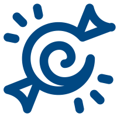
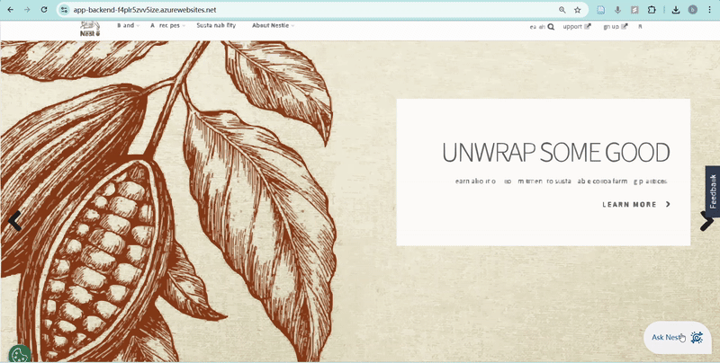
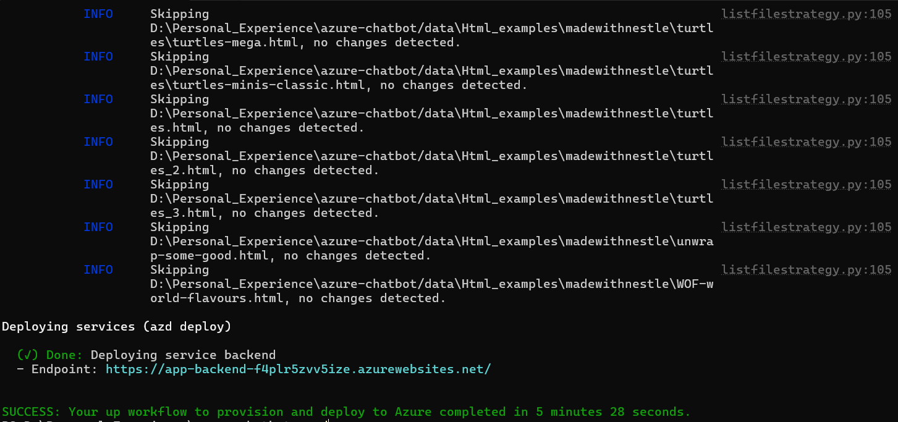
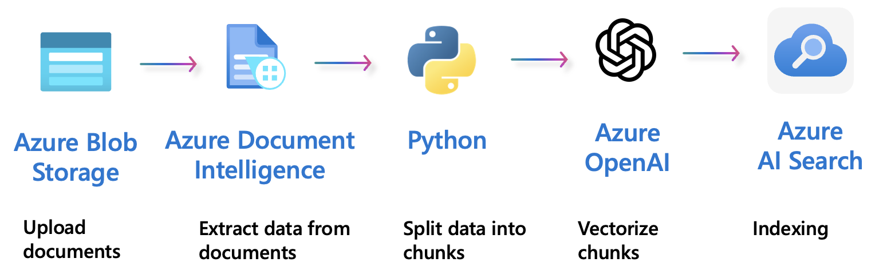

<a name="readme-top"></a>

<!-- PROJECT LOGO -->
<br />
<div align="center">

  <a>
    
  </a>

<h1 align="center">Nesty</h1>

  <p align="center" style="font-style: italic;">
    An AI chatbot project for the Nestlé website, featuring real-time web scraping, GraphRAG-based retrieval, and Azure deployment.
  </p>
  <p align="center">(<a href="https://app-backend-f4plr5zvv5ize.azurewebsites.net/">Demo</a>)</p>

</div>

<div align="center" style="text-align:center;">
  
  <div style="margin-top: 20px;"></div>
  <figcaption style="text-align:center"><em>Nesty answers users' questions based on the website information and provides reference paths.</em></figcaption>
</div>

<!-- ABOUT THE PROJECT -->
## About The Project

Nesty is an AI-driven chatbot that integrates seamlessly with the "Made with Nestlé" website, delivering real-time, context-aware responses to user queries. The chatbot features a customizable interface with a pop-out capability, and is deployed on Azure.

Key functionalities include dynamic web scraping of the website’s full content, semantic indexing using a vector database, and advanced retrieval via a Graph-based Retrieval-Augmented Generation (GraphRAG) module powered by graph database Cosmos DB. 

#### Built With
[![JavaScript][JavaScript]][JavaScript-url]
[![React][React]][React-url]
[![Vite][Vite]][Vite-url]
[![HTML][HTML]][HTML-url]
[![CSS][CSS]][CSS-url]
[![Python][Python]][Python-url]
[![Flask][Flask]][Flask-url]
[![Azure][Azure]][Azure-url]
[![CosmosDB][CosmosDB]][CosmosDB-url]

---

## Deployment

### Azure development of chat app

1. Setting up:

    - Download [Azure Developer CLI](https://aka.ms/azure-dev/install)
    - Download [Python 3.9, 3.10, or 3.11](https://www.python.org/downloads/), [Node.js 20+](https://nodejs.org/download/), [Git](https://git-scm.com/downloads), [Powershell 7+ (pwsh)](https://github.com/powershell/powershell) - For Windows users only.

2. Create a new folder and download the project code:

    ```shell
    azd init -t azure-search-openai-demo
    ```

3. Login to your Azure account (choose one according to the situation):

    ```shell
    azd auth login
    azd auth login --use-device-code
    azd auth login --tenant-id <your-tenant-id>
    ```

4. Create a new azd environment:

    ```shell
    azd env new
    ```

5. (Optional) Change environment variables for lowcost

    ```plaintext
    azd env set DEPLOYMENT_TARGET appservice
    azd env set AZURE_APP_SERVICE_SKU F1
    azd env set AZURE_SEARCH_SERVICE_SKU free
    azd env set AZURE_DOCUMENTINTELLIGENCE_SKU F0
    azd env set AZURE_COSMOSDB_SKU free
    azd env set OPENAI_HOST openai
    azd env set OPENAI_ORGANIZATION {Your OpenAI organization}
    azd env set OPENAI_API_KEY {Your OpenAI API key}
    ```

6. Run `azd up` 

    After the application has been successfully deployed you will see a URL printed to the console.  

    It will look like the following:
    


### Local development of chat app

You can only run locally **after** having successfully run the `azd up` command.

1. Run `azd auth login`
2. Start the server:

  Windows:

  ```shell
  ./app/start.ps1
  ```

  Linux/Mac:

  ```shell
  ./app/start.sh
  ```

### Reloading

1. Frontend:

    ```shell
    cd app/frontend
    npm run dev
    ```

    Navigate to the URL shown in the terminal (in this case `http://localhost:5173`).


2. Backend

    When you run `./start.ps1` or `./start.sh`, the backend files will be watched and reloaded automatically.


## Project Structure


[Image Source](https://docs.aws.amazon.com/sagemaker/latest/dg/jumpstart-foundation-models-customize-rag.html)

### Web application
Frontend: built from scratch using modern web technologies including Vite and React.

Backend: based on azure-search-openai-demo project: [azure-search-openai-demo](https://github.com/Azure-Samples/azure-search-openai-demo)

### Scaping

Python script `scrapemany.py` automates web crawling using `Selenium` and `BeautifulSoup`, capturing full HTML pages for a given domain (e.g., Nestlé brands).

Workflow:

1. Launches headless browser with anti-bot headers
2. Recursively crawls internal links (depth-limited)
3. Clicks "More" buttons to reveal hidden content
4. Saves full HTML to structured local folders
5. Records file-to-URL mapping for frontend use

### GraphRAG

[Image Source](https://github.com/Azure-Samples/azure-search-openai-demo/blob/main/docs/images/diagram_prepdocs.png)  

The `prepdocs.py` script handles both uploading and indexing documents through the following steps:

1. Creates a new Azure AI Search index if one doesn't already exist.

2. Uploads PDF files to Azure Blob Storage.

3. Splits each PDF into smaller text chunks.

4. Uploads the chunks to Azure AI Search—by default, this includes computing and attaching vector embeddings for enhanced search performance.


<!-- Inspiration -->
## Reference

This project draws inspiration from the excellent work in  
[Azure-Samples/azure-search-openai-demo](https://github.com/Azure-Samples/azure-search-openai-demo/tree/main),  
which provides a foundation for building retrieval-augmented generation (RAG) applications using Azure OpenAI and Cognitive Search.


<p align="right">(<a href="#readme-top">back to top</a>)</p>


<!-- MARKDOWN LINKS & IMAGES -->
<!-- Badge Links -->
[JavaScript]: https://img.shields.io/badge/JavaScript-F7DF1E?style=for-the-badge&logo=javascript&logoColor=black
[JavaScript-url]: https://www.javascript.com/

[React]: https://img.shields.io/badge/React-20232A?style=for-the-badge&logo=react&logoColor=61DAFB
[React-url]: https://reactjs.org/

[Vite]: https://img.shields.io/badge/Vite-646CFF?style=for-the-badge&logo=vite&logoColor=white
[Vite-url]: https://vitejs.dev/

[HTML]: https://img.shields.io/badge/HTML5-E34F26?style=for-the-badge&logo=html5&logoColor=white
[HTML-url]: https://html.com/

[CSS]: https://img.shields.io/badge/CSS3-1572B6?style=for-the-badge&logo=css3&logoColor=white
[CSS-url]: https://css3.com/

[Python]: https://img.shields.io/badge/Python-3776AB?style=for-the-badge&logo=python&logoColor=white
[Python-url]: https://www.python.org/

[Flask]: https://img.shields.io/badge/Flask-000000?style=for-the-badge&logo=flask&logoColor=white
[Flask-url]: https://flask.palletsprojects.com/

[Neo4j]: https://img.shields.io/badge/Neo4j-008CC1?style=for-the-badge&logo=neo4j&logoColor=white
[Neo4j-url]: https://neo4j.com/

[Azure]: https://img.shields.io/badge/Microsoft%20Azure-0089D6?style=for-the-badge&logo=azure&logoColor=white
[Azure-url]: https://azure.microsoft.com/
[CosmosDB]: https://img.shields.io/badge/Microsoft%20Azure%20Cosmos%20DB-FFB900?style=for-the-badge&logo=cosmosdb&logoColor=white
[CosmosDB-url]: https://azure.microsoft.com/en-us/products/cosmos-db/
